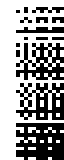

# minterm

Encore un émulateur Minitel ! En Flutter & Dart.

## Build Android

Il faut commenter la ligne faisant référence à `Registar` dans
`~/.pub-cache/hosted/pub.dev/flutter_libserialport-0.5.0/android/src/main/kotlin/org/sigrok/flutter_libserialport/FlutterLibserialportPlugin.kt`.

"/** import io.flutter.plugin.common.PluginRegistry.Registrar */"

Ensuite on peut suivre la doc ici :
<https://docs.flutter.dev/deployment/android#build-the-app-for-release>

Pour téléphone et tablette arm64, on peut ne construire que l'APK approprié :

```
$ flutter build apk --split-per-abi
...
✓ Built build/app/outputs/flutter-apk/app-armeabi-v7a-release.apk (7.3MB)
✓ Built build/app/outputs/flutter-apk/app-arm64-v8a-release.apk (7.8MB)
✓ Built build/app/outputs/flutter-apk/app-x86_64-release.apk (7.9MB)
```

On installe avec `flutter install`. On peut créer un lien vers le bon APK ou
utiliser `--use-application-binary` :

```
$ flutter install --use-application-binary=build/app/outputs/flutter-apk/app-x86_64-release.apk
Installing app-x86_64-release.apk to sdk gphone64 x86 64...
Uninstalling old version...
Installing build/app/outputs/flutter-apk/app-x86_64-release.apk...        662ms
```

## Bugs

* [x] **Série : Ajouter configuration par défaut (1200)**
* [x] **Série : mode 1200 et 4800 (comme sur minitel), du coup MinSettings au max**
* [ ] Sortir de la ligne 0 sur \r\n (à vérifier sur Minitel)

## TODO

* [ ] Émulation mode 80 colonnes et mode mixte
* [ ] Connexion serial to Minitel (output)
* [ ] Ajouter BASTOS (à priori non)
* [ ] Mode vidéo inverse (bof, pour BASTO / VP100)
* [ ] Implémenter clavier zx81 étendu
* [x] Implémenter blink et curdor blinking
* [x] Support ws et tcp
* [x] Clavier minitel 1b
* [x] Version Android
* [x] Ajouter websockets et services connus
* [x] `_MinPainter.drawChar()` : Utilise un `TMinitelChar`
* [x] `TMinitel.putChar()` : Traduire depuis la version assembleur
* [x] `_MinPainter.paint()` : Utilise un `TMinitel`, teste `kRedrawFlag` pour
  repeindre uniquement les caractères impactés

## Caractères

* Les jeux de caractères G0 et G2 sont générés au format PNG depuis
  `Minitel.ttf` de [Frédéric Bisson](https://zigazou.dev/)
  ([git](https://github.com/Zigazou)). Certains caractères sont redessinés (`Ç`,
  barres verticales gauche et droite, barre haut, pavé plein). `ttf2minterm.py`
  utilise `PIL` (_Pillow_) pour construire l'image RGBA correspondante et la
  sauvegarder dans `g0g2.png`. Les 31 caractères du jeu G2 (caractères accentués
  et spéciaux) sont placés dans les 2 premières colones de l'image.

  

* Le jeu de caractères G1 est généré depuis la fonte _bitmap_ `g18x10.bdf` de
  [Pierre Ficheux](http://pficheux.free.fr/) et de son émulateur
  [Xtel](http://pficheux.free.fr/xtel/). Le caractère #0 est redéfinit comme le
  masque à appliquer pour les graphiques disjoints. `xtel2minterm.py` utilise
  `bdfparser` et `PIL` (_Pillow_) pour construire l'image RGBA correspondante et
  la sauvegarder dans `g1.png`.

  

## Clavier


# Liens

* <https://fr.wikipedia.org/wiki/Micro-serveur_Minitel>
* <https://archive.org/details/minitel-stum1b/page/n39/mode/1up?view=theater>
